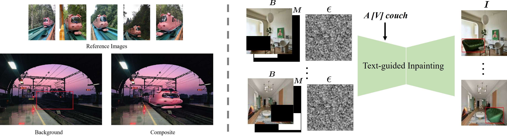
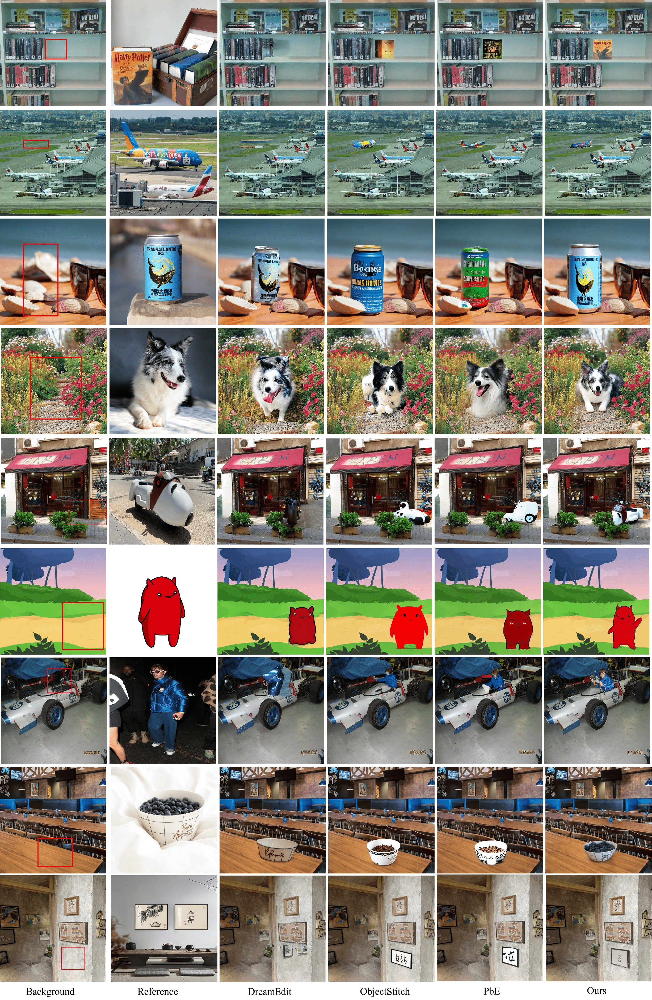

# DreamCom-Image-Composition


This is the official repository for the following research paper:

> **DreamCom: Finetuning Text-guided Inpainting Model for Image Composition**  [[arXiv]](https://arxiv.org/pdf/2309.15508.pdf)<br>
>
> Lingxiao Lu, Bo Zhang, Li Niu <br>
>

## Task

Given a few (3~5) reference images for a subject, we aim to customize a generative model, which can insert this subject into an arbitrary background image. In the obtained composite image, the foreground subject should be compatible with the background in terms of illumination, geometry, and semantics.

Technically, we finetune a text-guided inpainting model based on the reference images of one subject, during which a special token is associated with this subject. Then, we apply the finetuned model to a new background image. 

<p align='center'>  
  
</p>

## Code and Model

Our code is based on the basic code from the [diffusers library](https://github.com/huggingface/diffusers). Also, our model's format follows the rules set by the diffusers framework.

1.  Dependencies

    *   Python == 3.8
    *   Pytorch == 1.11.0
    *   Run

        ```bash
         conda env create -f environment.yml
        ```
2.  Download Models

    Please download the base model to the `diffusers-v1-5-inpaint/` folder.

    *   Our model is based on [runwayml/stable-diffusion-inpainting](https://huggingface.co/runwayml/stable-diffusion-inpainting).
3.  Dataset

    You can download our MureCom Dataset, and put it under the folder `MureCom/` for training and testing.
4.  Train

    You can execute the following code snippet to initiate the training process for a model. This model is specifically designed to establish a correlation between the unique train located in the `MureCom/Train/fg1` directory and the concept represented by `"a photo of sks train"`. The trained model will be subsequently stored within the `models/` directory.

    ```bash
    accelerate launch --num_processes=1 train.py --fg_name fg1 --image_num 5 --package_name="Train" --class_name="train" --pretrained_model_name_or_path="diffusers-v1-5-inpaint"  --instance_data_dir="MureCom/" --output_dir="models/" --instance_prompt="a photo of sks " --background_prompt="background" --resolution=512 --train_batch_size=1 --learning_rate=5e-6 --lr_scheduler="constant" --lr_warmup_steps=0 --max_train_steps=400 --gradient_accumulation_steps=1 
    ```
5.  Test

    You can execute the code provided below to utilize our recently trained model for generating sks train against the backgrounds found in the `MureCom/Train/bg` directory. The generated results will be appropriately stored in the corresponding location within the `MureCom/Train/result/fg1/` directory.

    ```bash
    python test.py --background_prompt="background" --do_crop --package_name="Train" --fg_name fg1 --image_num 5 --class_name="train"
    ```
6.  Train and test for all instances in MureCom

    ```bash
    bash train_and_test.sh
    ```

## Experiments

We show our results compared with some baselines. 

<p align='center'>  
  
</p>

## Our MureCom Dataset


Our MureCom dataset is available in the `/MureCom` folder. This folder consists of 32 subject subfolders, where each subfolder contains the following data:

- **Backgrounds**: Each subfolder includes 20 background images corresponding to that subject. These background images are stored in the `bg` folder together with their bounding boxes.
- **Foregrounds**: Each subfolder includes 3 sets of foreground images, with each set containing 5 images. The foreground images are stored in the `fg1`, `fg2`, and `fg3` folders together with their masks.


## Other Resources

+ We summarize the papers and codes of image composition from all aspects: [Awesome-Image-Composition](https://github.com/bcmi/Awesome-Image-Composition)
+ We summarize all possible evaluation metrics to evaluate the quality of composite images:  [Composite-Image-Evaluation](https://github.com/bcmi/Composite-Image-Evaluation)
+ We write a comprehensive on image composition: [the 3rd edition](https://arxiv.org/abs/2106.14490)
